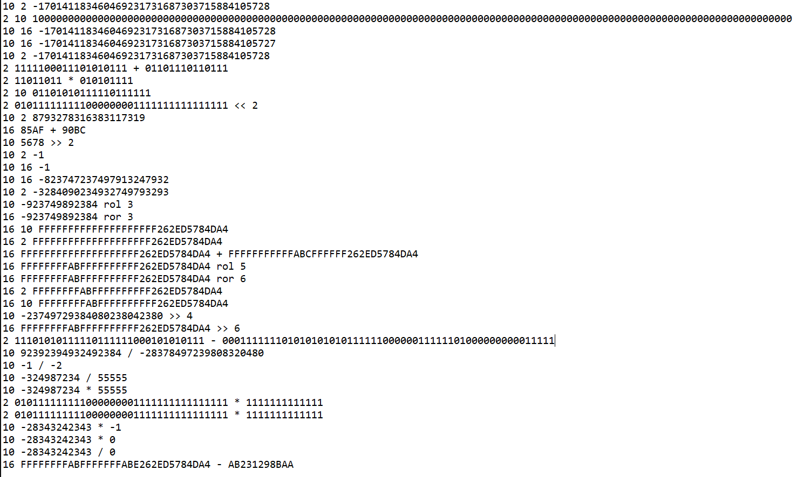
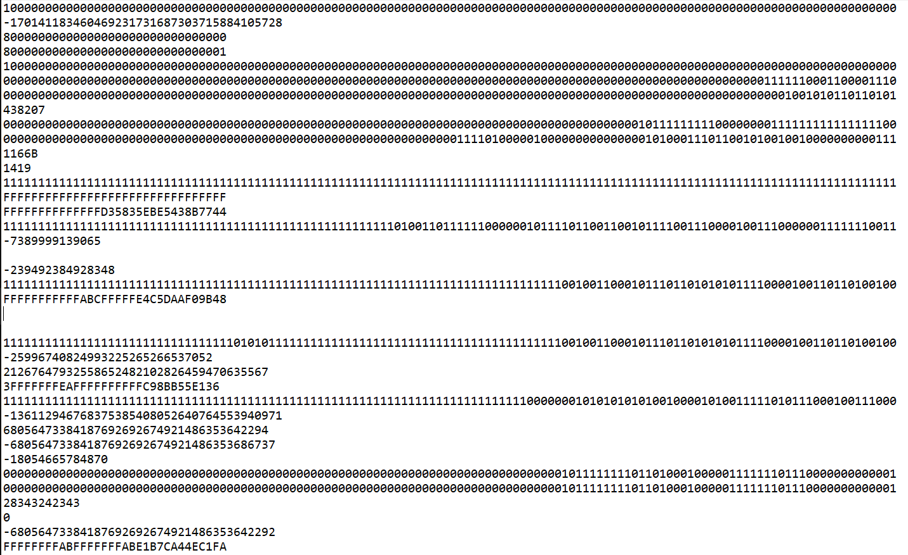
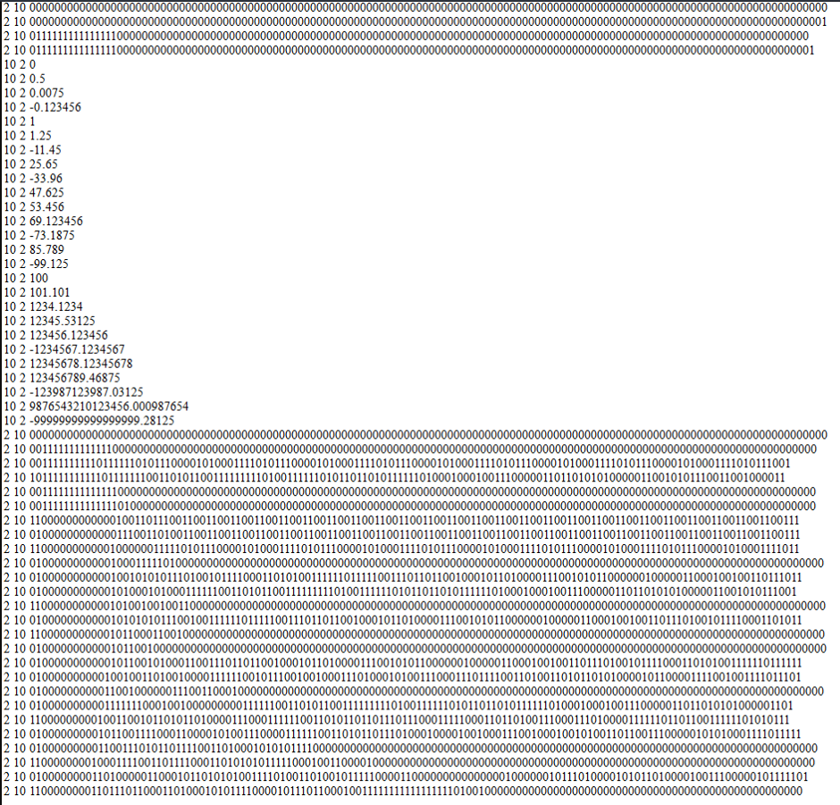
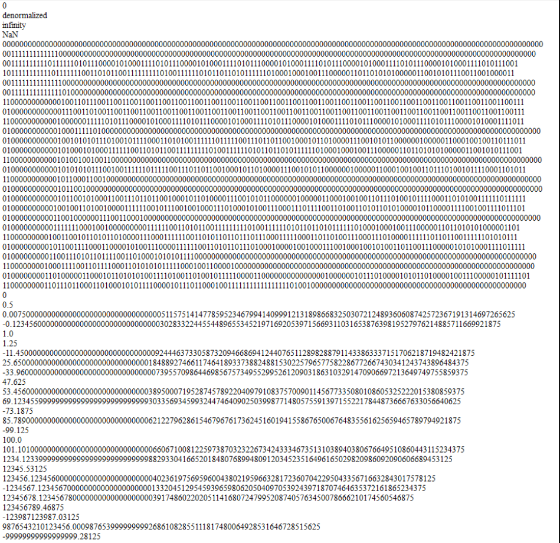

# Big Number Project
A project in my school (Assembly Language & Computer Architecture course) written in C++ for **big integer number** and **floating-point numbers** with high precision. (For details, check out <em>**main.cpp**</em>)

## Features
### Big integer number
 - Building <em> Qint </em>, big integer number 16 byte size
 - Scan/Print Qint for std in/out
 - Convert Qint Dec to Bin: <em> bool * DecToBin (QInt x) </em>
 - Convert Qint Bin to Dec: <em> QInt BinToDec(bool *bit) </em>
 - Convert Qint Bin to Hex: <em> char *BinToHex(bool *bit) </em>
 - Convert Qint Dec to Hex: <em> char *DecToHex(QInt x) </em>
 - Arithmetic operators:  <em> “+”, “-” , “*”, “/”</em>
 - Relational and assignment operators:  <em>“<”, “>”, “==”, “<=”, “>=”, “=” </em>
 - Bitwise operator: <em>AND “&”, OR “|”, XOR “^”, NOT “~”, “<<”, shift right “>>”, left rotation: “rol”, right rotation: “ror”</em>

 ### Floating-point numbers with high precision 128 bit
 - Building <em> Qfloat </em>, 128 bit
 - Scan/Print Qint for std in/out
 - Convert Qfloat Bin to Dec: <em> Qfloat BinToDec(bool *bit) </em>
 - Convert Qfloat Dec to Bin: <em> bool *DecToBin(Qfloat x) </em>
# Screenshots
 - Qint example

 - Qfloat example

# LICENSE
VNU-HCMUS - https://www.hcmus.edu.vn/